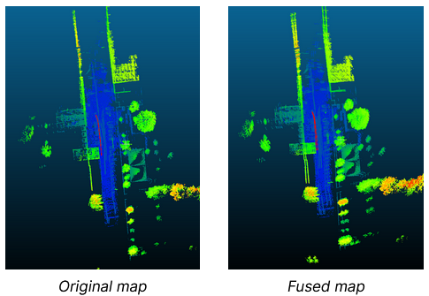

# Cooperative LiDAR Sensing and Map Fusion

This repository contains the code developed for my Bachelor’s Degree Thesis (TFG) in
Telecommunications Engineering, titled *Cooperative LiDAR Sensing in Vehicular Scenarios*.

The project explores a cooperative perception approach based on LiDAR data sharing,
with the objective of generating a consistent 3D map from two independent mobile robots.
The implementation follows an experimental, research-oriented methodology and was developed during an Erasmus exchange at Politecnico di Milano, in collaboration with the DEIB laboratory.


## Project Overview

Single-LiDAR perception systems suffer from limited field of view, occlusions, and blind
spots, especially in urban or dynamic environments. This work investigates a cooperative
LiDAR-based pipeline where information from two mobile robots is combined to improve
environmental awareness and mapping accuracy.

The implemented pipeline includes the following stages:

1. Offline preprocessing of LiDAR point clouds stored in CSV format
2. Detection and removal of dynamic objects (pedestrians) using YOLO applied to BEV images
3. Frame-to-map alignment using ICP-based registration
4. Trajectory estimation through accumulated transformations
5. Dual-robot map fusion using relative pose estimation and ICP refinement
6. Visualization of maps and robot trajectories

The system is implemented in Python, with a focus on alignment accuracy and map consistency.


## Example Result

Below is an example of the final fused static map obtained by aligning and merging
two LiDAR captures using object-based initialization and ICP refinement.



## Repository Structure

```text
src/
├── core/
│   ├── dual_lidar_fusion.py          # Dual-robot map fusion pipeline
│   ├── icp_alignment.py              # ICP-based point cloud alignment
│   ├── remove_yolo.py                # Dynamic object removal using YOLO detections
│   └── map_and_trajectory_viewer.py  # Map and trajectory visualization
│
└── experiments/
    ├── dual_lidar/
    ├── icp_alignment/
    ├── visualization/
    ├── yolo_detection/
    └── YOLO_file/
```

- **`core/`** contains the scripts corresponding to the final pipeline used to obtain the results presented in the thesis.
- **`experiments/`** groups experimental code, intermediate versions, tests, datasets, and results generated during the iterative development process.

## Notes

This repository reflects an academic research workflow.
Multiple script versions and experimental components are intentionally preserved to
document the evolution of the proposed methods.

Some large data files and trained models used during experimentation are included only
partially or for reference purposes.

## Related Documents

- Bachelor’s Thesis (PDF):  
  [Cooperative LiDAR Sensing in Vehicular Scenarios](docs/BachelorThesis_AlbertTomas_Cooperative_LiDAR_Sensing_2025.pdf)

- Thesis presentation slides (PDF):  
  [Project presentation](docs/BachelorThesisPresentation_AlbertTomas_Cooperative_LiDAR_Sensing_2025.pdf)

## Author

Albert Tomàs Ruiz  
Bachelor’s Degree in Telecommunications Engineering  
Universitat Politècnica de Catalunya (UPC)